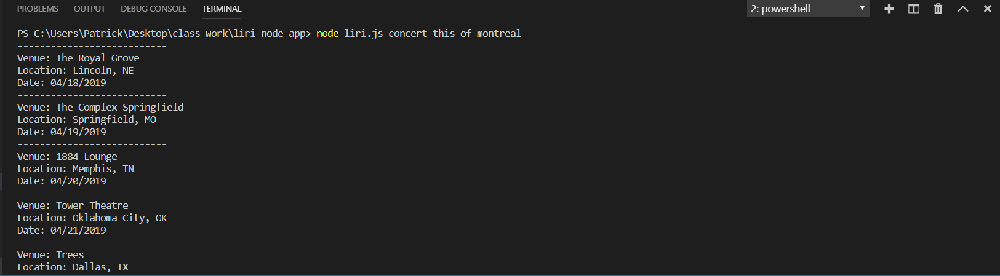
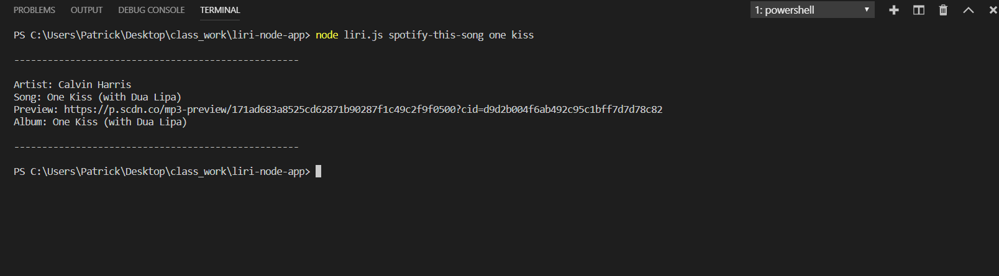

# liri-node-app

Liri is a Language Interpretation and a Recognition interface that takes in certain commands and outputs data to the user. It's alot like iphone's SIRI except it only returns specific data. Liri can search: BandsinTown for concert locations, spotify for song information, and OMDB for movie information.

## Possible commands to run
`concert-this` `spotify-this-song` `movie-this` `do-what-it-says`

---

## Bands in Town Search
`node liri.js concert-this <artist-name>`

`concert-this` will search the BandsInTown API for upcoming concerts related to the artist that was searched. Venue loaction, date, and time are provided for each result. Moment.js is being utilized to format the date to a more readable format. 

---

## Spotify Search
`node liri.js spotify-this-song <song-name-here>`

`spotify-this-song` will search Spotify API for information on the song tha was searched. Song name, artist name, link to a preview of the song, and the album that the song was released in.

