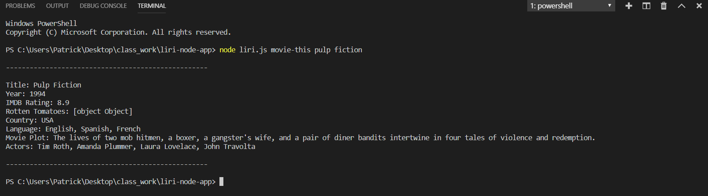
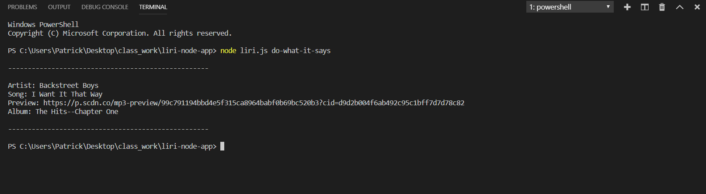

# liri-node-app

Liri is a Language Interpretation and Recognition interface that takes in certain commands and outputs data to the user. It's alot like iphone's SIRI except it only returns specific data. Liri can search: BandsinTown for concert locations, spotify for song information, and OMDB for movie information.

## Possible commands to run
`concert-this` `spotify-this-song` `movie-this` `do-what-it-says`

---

## Bands in Town Search
`node liri.js concert-this <artist-name>`

`concert-this` will search the BandsInTown API for upcoming concerts related to the artist that was searched. Venue loaction, date, and time are provided for each result. Moment.js is being utilized to format the date to a more readable format. 

---

## Spotify Search
`node liri.js spotify-this-song <song-name-here>`

`spotify-this-song` will search Spotify API for information on the song that was searched. Song name, artist name, link to a preview of the song, and the album that the song was released in is included for each result.

---

## OMDB Movie Search
`node liri.js movie-this <song-name-here>`

`movie-this` will search OMDB movies API for information on the movie that was searched. Title of the movie, year the movie came out, IMDB Rating of the movie, Rotten Tomatoes rating of the movie, country where the movie was produced, language of the movie, plot of the movie, and actors in the movie will all be shown with each result. If no movie is selected MR. Nobody is defaulted in the search.

---

## Do what it says search
`do-what-it-says`

`do-what-it-says` is a command that reads the file random.text and executes it according to the parameters in the file. Default is set to `spotify-this-song I Want It That Way`.

---

## Built With
Javascript, Node.js, Moment.js, Bandsintown API, Spotify API, OMDb API

---

## Authors
Patrick Caserta

